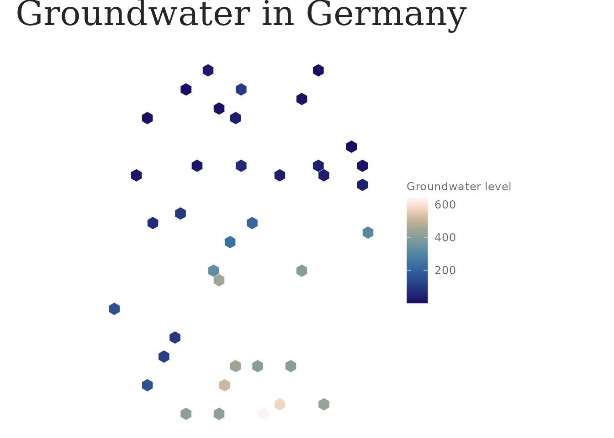

# Getting started with lapidary

``` r

library(lapidary)
```

`lapidary` has three layers: a **canonical data model**, **analysis
primitives**, and a **shared visual style**. This vignette walks through
them with the packaged sample of GEMS-GER
([`?gems_ger_sample`](https://mxnl.github.io/lapidary/reference/gems_ger_sample.md)),
so nothing here needs the full download.

## The data model

Every source is normalised to two shapes:

- `gwl_ts` — a tidy long tibble, one row per well × timestamp
  (`well_id`, `date`, `gwl`, `variable`, `source`, optional `gwl_flag`);
- `gwl_wells` — an `sf` POINT layer of well metadata in EPSG:25832.

``` r

data(gems_ger_sample)
gems_ger_sample
#> <gwl_ts> 66,760 rows | 40 wells | 1991-01-07 .. 2022-12-26
#> variable: gwl_m_asl | source: gems-ger
#> # A tibble: 66,760 × 9
#>    well_id date         gwl variable  source   gwl_flag water_year water_month
#>    <chr>   <date>     <dbl> <chr>     <chr>    <fct>         <int>       <int>
#>  1 MW_1039 1991-01-07  413. gwl_m_asl gems-ger observed       1991           3
#>  2 MW_1039 1991-01-14  412. gwl_m_asl gems-ger observed       1991           3
#>  3 MW_1039 1991-01-21  412. gwl_m_asl gems-ger observed       1991           3
#>  4 MW_1039 1991-01-28  412. gwl_m_asl gems-ger observed       1991           3
#>  5 MW_1039 1991-02-04  412. gwl_m_asl gems-ger observed       1991           4
#>  6 MW_1039 1991-02-11  412. gwl_m_asl gems-ger observed       1991           4
#>  7 MW_1039 1991-02-18  412. gwl_m_asl gems-ger observed       1991           4
#>  8 MW_1039 1991-02-25  412. gwl_m_asl gems-ger observed       1991           4
#>  9 MW_1039 1991-03-04  412. gwl_m_asl gems-ger observed       1991           5
#> 10 MW_1039 1991-03-11  412. gwl_m_asl gems-ger observed       1991           5
#> # ℹ 66,750 more rows
#> # ℹ 1 more variable: reference_period <fct>

validate_gwl_ts(gems_ger_sample)
```

`variable` records *what* `gwl` is (here `"gwl_m_asl"`, metres above sea
level), so series with different datums never get mixed silently.

To ingest the real dataset:

``` r

lap_gems_ger_download()                    # ~290 MB, once
lap_gems_ger_build_parquet(meteo = FALSE)  # CSV -> Parquet, once
gwl <- lap_read_gems_ger(date_range = c("2000-01-01", "2020-12-31"))
```

Adding another source means writing a reader that returns these shapes;
[`lap_read_correctiv()`](https://mxnl.github.io/lapidary/reference/lap_read_correctiv.md)
is a worked second example.

## Analysis primitives

``` r

enriched <- gems_ger_sample |>
  lap_use_water_year(start_month = 11) |>
  lap_add_reference_period(periods = list(Z1 = c(1991, 2020)))

annual <- lap_summarise_wells(enriched, by = c(well_id, year))
head(annual)
#> # A tibble: 6 × 9
#>   well_id  year min_gwl max_gwl mean_gwl median_gwl sd_gwl n_obs coverage
#>   <chr>   <int>   <dbl>   <dbl>    <dbl>      <dbl>  <dbl> <int>    <dbl>
#> 1 MW_1039  1991    412.    413.     412.       412.  0.289    52     1   
#> 2 MW_1039  1992    412.    413.     412.       412.  0.362    52     1   
#> 3 MW_1039  1993    412.    413.     412.       412.  0.262    52     1   
#> 4 MW_1039  1994    412.    413.     412.       412.  0.227    52     1   
#> 5 MW_1039  1995    412.    413.     412.       412.  0.293    52     1   
#> 6 MW_1039  1996    412.    413.     412.       412.  0.215    53     1.02
```

Trends use the Theil–Sen slope with a Mann–Kendall significance test:

``` r

trends <- lap_gw_trend(annual, value = mean_gwl, time = year)
head(trends[order(trends$slope), c("well_id", "slope", "p_value", "direction")])
#> # A tibble: 6 × 4
#>   well_id   slope      p_value direction 
#>   <chr>     <dbl>        <dbl> <chr>     
#> 1 MW_1419 -0.158  0.189        decreasing
#> 2 MW_906  -0.0569 0.0000000321 decreasing
#> 3 MW_299  -0.0390 0.000000162  decreasing
#> 4 MW_693  -0.0373 0.000158     decreasing
#> 5 MW_1846 -0.0363 0.00677      decreasing
#> 6 MW_2549 -0.0216 0.101        decreasing
```

### Time-series indicators

Derived *per-well* metrics (`ind_*` columns) are computed straight from
the time series — a separate table from the per-well-year summary above.
[`lap_indicator_registry()`](https://mxnl.github.io/lapidary/reference/lap_indicator_registry.md)
lists what is available:

``` r

lap_indicator_registry()
#> # A tibble: 17 × 8
#>    key               columns range units needs_date in_all description reference
#>    <chr>             <chr>   <chr> <chr> <lgl>      <lgl>  <chr>       <chr>    
#>  1 amplitude         ind_am… [0, … m     FALSE      TRUE   max - min … descript…
#>  2 seasonal_amplitu… ind_se… [0, … m     TRUE       TRUE   mean over … descript…
#>  3 seasonality_stre… ind_se… [0, … -     TRUE       TRUE   STL varian… Wang, Sm…
#>  4 recharge_dischar… ind_re… [1, … mont… TRUE       TRUE   length of … descript…
#>  5 phase_regularity  ind_mi… [0, … mont… TRUE       TRUE   circular S… Mardia &…
#>  6 extreme_months    ind_mi… (0.5… mont… TRUE       TRUE   circular-m… Mardia &…
#>  7 flashiness        ind_fl… [1, … -     FALSE      TRUE   sum(|diff(… Baker et…
#>  8 memory            ind_ac… [-1,… - | … TRUE       TRUE   lag-1 auto… Rinaldo …
#>  9 rise_fall         ind_ri… (0, … m pe… FALSE      TRUE   median rat… descript…
#> 10 trend             ind_tr… (-In… m/ye… TRUE       TRUE   Theil-Sen … Sen (196…
#> 11 trend_extremes    ind_tr… (-In… m/ye… TRUE       TRUE   Theil-Sen … Sen (196…
#> 12 step_change       ind_st… NA |… year… TRUE       TRUE   Pettitt ch… Pettitt …
#> 13 trend_accelerati… ind_tr… (-In… m/ye… TRUE       TRUE   Sen slope(… descript…
#> 14 drought           ind_dr… [0, … - | … FALSE      FALSE  run-theory… Bloomfie…
#> 15 drought_recovery  ind_dr… [0, … week… FALSE      FALSE  recovery t… Peterson…
#> 16 climate_signal    ind_ac… [1, … mont… TRUE       FALSE  climate re… Ebeling …
#> 17 recession         ind_re… (0, … week… FALSE      TRUE   master-rec… Posavec,…
```

Compute them with
[`lap_indicators()`](https://mxnl.github.io/lapidary/reference/lap_indicators.md),
or append them to an existing well-level table with
[`lap_add_indicators()`](https://mxnl.github.io/lapidary/reference/lap_add_indicators.md).
`.funs` takes `"all"`, registry keys, or `lap_ind_*()` functions.

`"all"` is data-aware: it runs every indicator whose inputs are in the
data. Most need only the level column, but the drought and climate ones
need a standardised index (`lap_normalise_gwl("sgi")`) and, for
`climate_signal`, a joined driver
([`lap_join_meteo()`](https://mxnl.github.io/lapidary/reference/lap_join_meteo.md)).
Add those columns and `"all"` picks the indicators up by itself, using
`gwl_norm` and `precip` in place of `value`; if they are missing it says
which indicators it skipped and why.

``` r

lap_summarise_wells(gems_ger_sample, by = well_id) |>
  lap_add_indicators(gems_ger_sample, "all") |>
  dplyr::select(well_id, mean_gwl, dplyr::starts_with("ind_")) |>
  head()
#> ℹ "all" skipped "drought", "drought_recovery", and "climate_signal": no
#>   standardised column - add `lap_normalise_gwl("sgi")`.
#> # A tibble: 6 × 26
#>   well_id mean_gwl ind_amplitude ind_seasonal_amplitude ind_seasonality_strength
#>   <chr>      <dbl>         <dbl>                  <dbl>                    <dbl>
#> 1 MW_1039     412.          2.38                  1.21                    0.0601
#> 2 MW_1051     511.          2.44                  1.15                    0.132 
#> 3 MW_1105     411.          1.19                  0.449                   0.0840
#> 4 MW_1230     165.          1.12                  0.469                   0.0602
#> 5 MW_1249     394.          1.49                  0.755                   0.348 
#> 6 MW_1268     402.          2.99                  1.12                    0.109 
#> # ℹ 21 more variables: ind_recharge_months <dbl>, ind_discharge_months <dbl>,
#> #   ind_min_month_sd <dbl>, ind_min_month <dbl>, ind_max_month <dbl>,
#> #   ind_flashiness <dbl>, ind_acf1 <dbl>, ind_memory_weeks <dbl>,
#> #   ind_rise_rate <dbl>, ind_fall_rate <dbl>, ind_trend_slope <dbl>,
#> #   ind_trend_p_value <dbl>, ind_trend_significant <lgl>,
#> #   ind_trend_min_slope <dbl>, ind_trend_max_slope <dbl>, ind_step_year <dbl>,
#> #   ind_step_magnitude <dbl>, ind_step_p_value <dbl>, ind_trend_accel <dbl>, …
```

### Change over decades

[`lap_indicator_change()`](https://mxnl.github.io/lapidary/reference/lap_indicator_change.md)
computes any indicator over several (possibly overlapping) year windows;
[`lap_indicator_delta()`](https://mxnl.github.io/lapidary/reference/lap_indicator_delta.md)
turns that into one row per well with the change between two of them.

``` r

chg <- lap_indicator_change(
  gems_ger_sample, c("trend", "seasonal_amplitude", "extreme_months"),
  periods = list(reference = c(1991, 2010), recent = c(2011, 2022))
)

lap_indicator_delta(chg, from = "reference", to = "recent") |>
  dplyr::select(well_id, dplyr::ends_with("_change")) |>
  head()
#> # A tibble: 6 × 5
#>   well_id ind_trend_slope_change ind_seasonal_amplitude_c…¹ ind_min_month_change
#>   <chr>                    <dbl>                      <dbl>                <dbl>
#> 1 MW_1039               -0.0106                      0.0571                0.169
#> 2 MW_1051               -0.00185                     0.282                -0.116
#> 3 MW_1105               -0.0229                     -0.0591               -2.56 
#> 4 MW_1230               -0.0139                      0.0644                0.707
#> 5 MW_1249               -0.00635                    -0.146                -0.598
#> 6 MW_1268               -0.00437                    -0.108                -0.468
#> # ℹ abbreviated name: ¹​ind_seasonal_amplitude_change
#> # ℹ 1 more variable: ind_max_month_change <dbl>
```

[`lap_period_windows()`](https://mxnl.github.io/lapidary/reference/lap_period_windows.md)
derives the `periods` list from the record itself, so you do not
hand-write year pairs:

``` r

lap_period_windows(gems_ger_sample, "first_vs_last_decade")
#> $first
#> [1] 1991 2000
#> 
#> $last
#> [1] 2013 2022
lap_period_windows(gems_ger_sample, "decade_per_decade")
#> $`1991-2000`
#> [1] 1991 2000
#> 
#> $`2001-2010`
#> [1] 2001 2010
#> 
#> $`2011-2020`
#> [1] 2011 2020
#> 
#> $`2021-2022`
#> [1] 2021 2022
```

Drought indicators expect a standardised index — add one first:

``` r

gems_ger_sample |>
  lap_normalise_gwl("sgi") |>
  lap_indicators(c("drought", "drought_recovery"), value = gwl_norm) |>
  head()
#> # A tibble: 6 × 11
#>   well_id ind_drought_frequency ind_frac_below_normal ind_index_min
#>   <chr>                   <dbl>                 <dbl>         <dbl>
#> 1 MW_1039                 0.155                 0.495         -2.46
#> 2 MW_1051                 0.160                 0.497         -2.46
#> 3 MW_1105                 0.157                 0.496         -2.46
#> 4 MW_1230                 0.156                 0.500         -2.46
#> 5 MW_1249                 0.156                 0.499         -2.46
#> 6 MW_1268                 0.156                 0.498         -2.46
#> # ℹ 7 more variables: ind_drought_n_events <int>,
#> #   ind_drought_duration_weeks <dbl>, ind_drought_max_weeks <int>,
#> #   ind_drought_severity <dbl>, ind_drought_intensity <dbl>,
#> #   ind_drought_recovery_weeks <dbl>, ind_drought_n_unrecovered <int>
```

### Climate coupling & anthropogenic signal

[`lap_join_meteo()`](https://mxnl.github.io/lapidary/reference/lap_join_meteo.md)
attaches GEMS-GER’s co-located meteorological forcings, and
`climate_signal` then separates the climate-driven variation from the
residual (often anthropogenic) long-term trend:

``` r

lap_read_gems_ger() |>
  lap_join_meteo(c(precip = "HYRAS_pr")) |>
  lap_normalise_gwl("sgi") |>
  lap_indicators("climate_signal", value = gwl_norm, driver = precip)
```

[`vignette("indicators")`](https://mxnl.github.io/lapidary/articles/indicators.md)
explains every catalogue key — definition, interpretation and citation —
including how `memory`, `climate_signal` and `recession` capture three
different aquifer timescales.

Normalisation makes wells comparable:

``` r

sgi <- lap_normalise_gwl(gems_ger_sample, method = "sgi")
range(sgi$gwl_norm, na.rm = TRUE)
#> [1] -2.460124  2.460124
```

## Spatial aggregation

``` r

data(germany_hex_sample)
germany_hex_sample
#> Simple feature collection with 747 features and 4 fields
#> Geometry type: POLYGON
#> Dimension:     XY
#> Bounding box:  xmin: 267159.3 ymin: 5222393 xmax: 942159.3 ymax: 6117286
#> Projected CRS: ETRS89 / UTM zone 32N
#> First 10 features:
#>    hex_id n_wells mean_gwl sd_gwl                       geometry
#> 1       1       0       NA     NA POLYGON ((279659.3 5612104,...
#> 2       2       0       NA     NA POLYGON ((279659.3 5655405,...
#> 3       3       0       NA     NA POLYGON ((292159.3 5547152,...
#> 4       4       0       NA     NA POLYGON ((292159.3 5590454,...
#> 5       5       0       NA     NA POLYGON ((292159.3 5633755,...
#> 6       6       0       NA     NA POLYGON ((292159.3 5677056,...
#> 7       7       0       NA     NA POLYGON ((292159.3 5720357,...
#> 8       8       0       NA     NA POLYGON ((304659.3 5482200,...
#> 9       9       0       NA     NA POLYGON ((304659.3 5525502,...
#> 10     10       0       NA     NA POLYGON ((304659.3 5568803,...
```

`germany_hex_sample` was built with
[`lap_aggregate_to_hex()`](https://mxnl.github.io/lapidary/reference/lap_aggregate_to_hex.md)
from the sample wells; with the full dataset the hexagons are densely
populated.

## Style

``` r

library(ggplot2)

ggplot(germany_hex_sample) +
  geom_sf(aes(fill = mean_gwl), colour = "white", linewidth = 0.1) +
  scale_fill_lapidary_c("magnitude") +
  lap_na_guide() +
  theme_lapidary(variant = "light") +
  labs(title = lap_tr("app_title"), fill = lap_tr("groundwater_level"))
```



Switch `variant = "dark"`, set `options(lapidary.lang = "de")`, and use
`ggsave_lapidary(preset = "a1")` for print output. See
[`vignette("style", package = "lapidary")`](https://mxnl.github.io/lapidary/articles/style.md).
