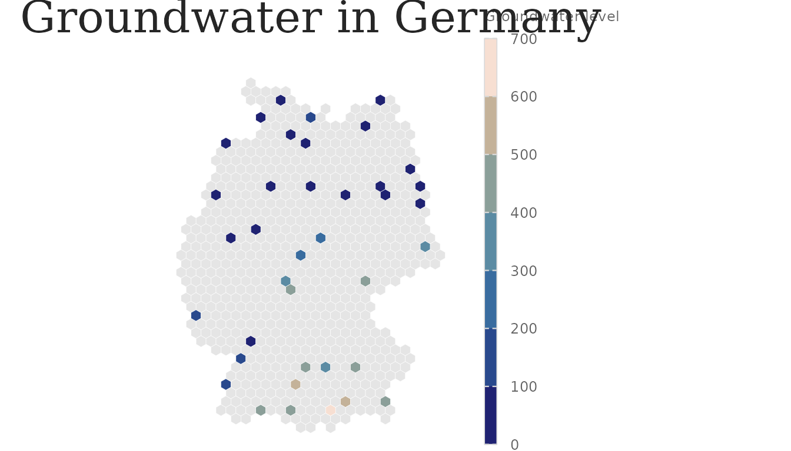
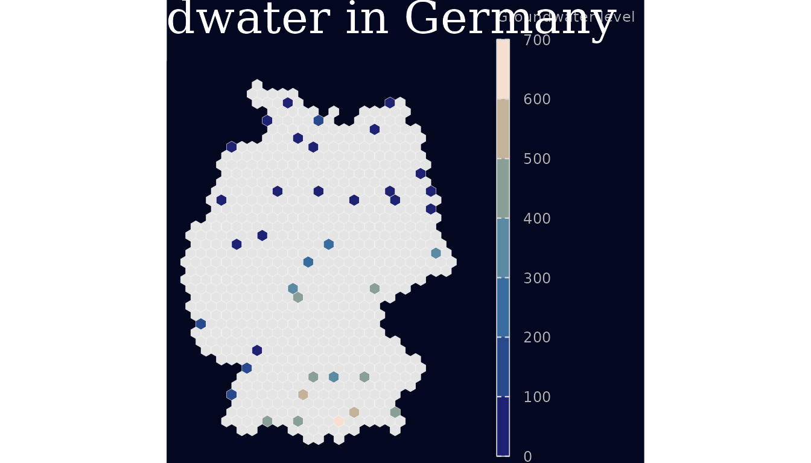

# The lapidary style scheme

``` r

library(lapidary)
library(ggplot2)
```

The visual style is one system with a light and a dark variant, driven
by a single set of **design tokens**. Plot code reads tokens through
[`lap_tokens()`](https://mxnl.github.io/lapidary/reference/lap_tokens.md)
rather than hard-coding values, so a restyle happens in one place (see
`docs/adr/0003`).

## Tokens

``` r

tk <- lap_tokens("light")
str(tk, max.level = 1)
#> List of 7
#>  $ variant   : chr "light"
#>  $ colour    :List of 11
#>  $ font      :List of 6
#>  $ size      :List of 7
#>  $ spacing   :List of 3
#>  $ effect    :List of 3
#>  $ lineheight:List of 1
tk$colour$recharge
#> [1] "#506ea7"
tk$colour$discharge
#> [1] "#b38435"
```

Type sizes are multipliers of a `base_size`, which is how the *same*
plot scales from web to A0.

## Theme and scales

The continuous `scale_*_lapidary_c()` scales are **binned** at pretty
round breaks and drawn as a long, thin colour-steps bar; the legend
title is prettified from the mapped variable (see
[`lap_prettify_label()`](https://mxnl.github.io/lapidary/reference/lap_prettify_label.md))
unless you set
`name`/[`labs()`](https://ggplot2.tidyverse.org/reference/labs.html);
and
[`lap_na_guide()`](https://mxnl.github.io/lapidary/reference/lap_na_guide.md)
adds a “no data” key for `NA` regions such as empty hexes.

``` r

data(germany_hex_sample)

p <- ggplot(germany_hex_sample) +
  geom_sf(aes(fill = mean_gwl), colour = "white", linewidth = 0.1) +
  scale_fill_lapidary_c("magnitude") +
  lap_na_guide() +
  labs(title = lap_tr("app_title"), fill = lap_tr("groundwater_level"))

p + theme_lapidary("light")
```



``` r

p + theme_lapidary("dark")
```



Palette roles decouple intent from the underlying scico palette:

``` r

lap_pal_roles()
#> [1] "months"         "magnitude"      "magnitude_dark" "density"       
#> [5] "anomaly"
```

- `months` – cyclic, for month-of-year / phase
- `magnitude` / `magnitude_dark` – sequential
- `density` – sequential greys, for counts
- `anomaly` – divergent, for departures from a reference

## Fonts

[`lap_fonts()`](https://mxnl.github.io/lapidary/reference/lap_fonts.md)
registers Oleo Script (titles) and Dosis (body) and enables `showtext`.
If the fonts or packages are missing it is a no-op and the theme falls
back to `serif` / `sans`, so headless rendering never breaks.

``` r

lap_fonts()
```

## Output presets

``` r

lap_preset_names()
#> [1] "web"      "web_wide" "a4"       "a3"       "a2"       "a1"       "a0"
lap_preset("a1")
#> $width
#> [1] 59.4
#> 
#> $height
#> [1] 84.1
#> 
#> $units
#> [1] "cm"
#> 
#> $dpi
#> [1] 300
#> 
#> $base_size
#> [1] 22
```

[`ggsave_lapidary()`](https://mxnl.github.io/lapidary/reference/ggsave_lapidary.md)
applies a preset’s width/height/dpi *and* sets `showtext`’s DPI to
match, which is the difference between crisp and blurry poster text.

``` r

ggsave_lapidary(p + theme_lapidary("light", base_size = lap_preset("a1")$base_size),
  "groundwater_a1.png",
  preset = "a1"
)
```

## Language

``` r

lap_tr("groundwater_level", "en")
#> [1] "Groundwater level"
lap_tr("groundwater_level", "de")
#> [1] "Grundwasserstand"
```

Set a session default with `options(lapidary.lang = "de")` or the
`LAPIDARY_LANG` environment variable.
